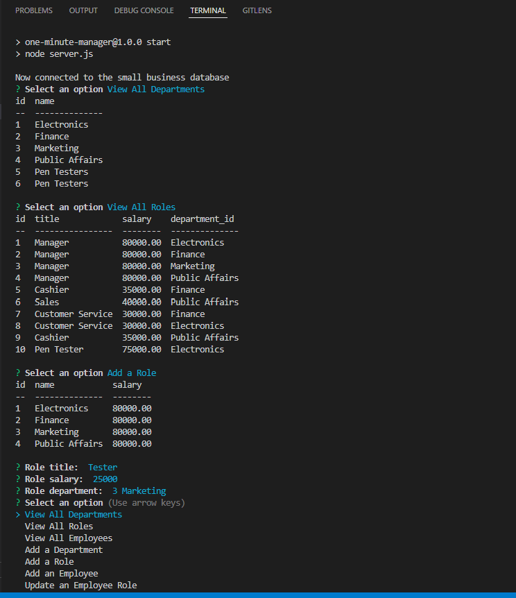

# One Minute Manager

## Description
A simple Command Line Interface (CLI) application designed with small business owners in mind. Through a series of user prompts in the CLI small business owners can view information about their business such as the departments, employees, and the roles those employees hold. The user can also manipulate data contained in the tables presented. Executing an option provides the data in a readable table format using console.table.

## Table of Contents
* [Installation](#installation)
* [Usage](#usage)
* [Contributors](#contributors)
* [Tests](#tests)
* [Questions](#questions)
* [License](#license) 

## Installation
Use 'npm i' in the root directory of the codebase, then initialize the application using 'npm start.'

## Usage
Designed for small business owners, see screenshot below.

## Contributors
None at this time

## Tests
Tested using insomnia during development.

Contact information (email address & GitHub username) of the developer
## Questions
kevin.o.foreman2@gmail.com / kevin-foreman (GitHub)

## License

The license used for this project is 

## Screenshot

